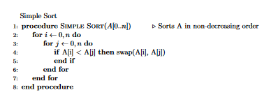

# SimpleSort

Implementations of the most beautiful sorting algorithm known to man.

Timsort? Radix Sort? Quicksort? Quantum BogoSort? Parallel Bitonic Merge Sort???? You must've hit your head pretty hard. Here, lets go sort with 2 perfectly symmetric loops.

## The Algorithm

Given an array of $N$ elements, 
$A = [a_0,..., a_N]$

The Simple Sort algorithm is defined as the procedure

### Algorithmic Analysis

The worst-case time complexity of Simple Sort is quite intuitively $O(N^2)$

Its worst-case space complexity is clearly $O(1)$

## The Paper

The original paper of the algorithm is [here](https://arxiv.org/pdf/2110.01111.pdf)

it is also available as a PDF in the /paper/ directory.

There is also a wonderful video by [Polylog](https://www.youtube.com/watch?v=_W0yUJlscRA&t=54s&ab_channel=polylog) on Simple Sort.